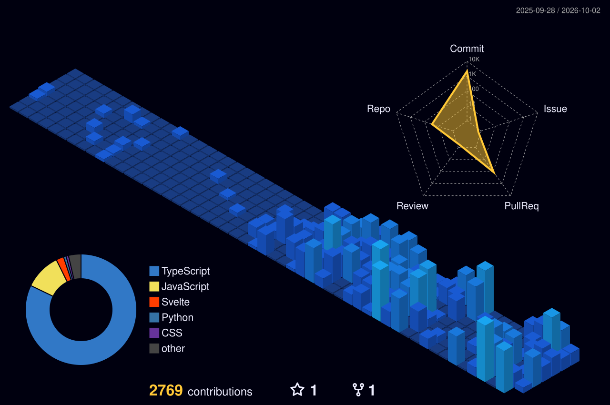



  <h1>Eneko Ruiz</h1>
  
<b>Software Engineer &middot; Full-Stack Developer</b>

  

    Construyendo aplicaciones web robustas y escalables con el foco puesto en la calidad del producto y el código limpio. Cuando no estoy tecleando, probablemente esté con un café, una guitarra o de viaje.
  

  
  

    <a href="https://eneko-ruiz.vercel.app">Portfolio</a> &nbsp;&middot;&nbsp;
    <a href="https://eneko-ruiz-curriculum.vercel.app">Currículum</a> &nbsp;&middot;&nbsp;
    <a href="https://linkedin.com/in/eneko-ruiz-421254410/">LinkedIn</a>
  

  
  

 
 

  <h3>Stack Principal</h3>
   
  

 
 

  <h3>Proyectos Destacados</h3>
   
  <table>
    <tr>
      <td align="center" width="50%">
        <b><a href="https://eneko-ruiz.vercel.app">Portfolio Personal</a></b> 
        Diseño minimalista, transiciones fluidas y alto rendimiento. 
        <i>HTML, CSS, JS</i>
      </td>
      <td align="center" width="50%">
        <b><a href="#">Recordatorios App</a></b> 
        PWA Full-Stack para gestión avanzada de tareas. 
        <i>React, Node.js, Prisma, PostgreSQL</i>
      </td>
    </tr>
  </table>

 
 

  <h3>Actividad</h3>
   
  <!-- Gráfico 3D generado por Actions (puedes borrarlo si también lo ves sobrecargado) -->
  

